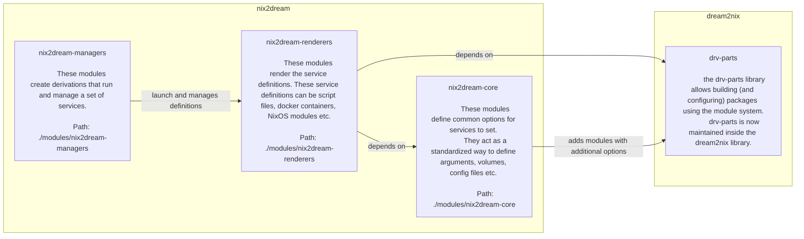

# Nix2Dream

Use the NixOs module system turn derivations into services that can be launched/managed by any supported service-manager:

- [x] procfile
- [ ] NixOS Service
- [ ] NixOS VM 
- [ ] Docker
  - [ ] Kubernetes
  - [ ] Docker Compose

Few features are implemented currently, but I have confidence in the architecture and that it will scale. See the [Roadmap](https://github.com/DrRuhe/nix2dream/issues/1) for the current status.

# Architecture


# Usage: 

## As a flake-parts module
To use nix2dream in a flake-parts flake, you can import the flakeModule by adding `inputs.nix2dream.flakeModule` to your imports:
```nix
imports = [
    inputs.nix2dream.flakeModule
];
```
Then, services and deployments can be defined under `perSystems.deployments`. See the [examples](./examples).


## Standalone
The modules do not require flake-parts and can be integrated into other module-systems by using `inputs.nix2dream.standaloneSubmodule` as a submodule. You can look at `./nix/flake-parts/nix2dream.nix` for a reference on how this is done for integration with the flake-parts module ecosystem.

# Contact
Feel free to open Issues [here](https://github.com/DrRuhe/nix2dream/issues/new/choose).


# Migrating an Existing Service:

## NixOs Services:
NixOS uses a module system as well to configure services. These services typically expose options under `service.<name>` that are an abstraction layer above `systemd.services.<name>`. As such, migrating a service from nixpkgs requires reimplementation of the module.

Here is a list of `systemd.services.<name>` options and the equivalent core options when defining a system ([source of this list](https://search.nixos.org/options?channel=unstable&show=systemd.services.%3Cname%3E.reload&from=0&size=50&sort=relevance&type=packages&query=systemd.services)):
- `systemd.services.<name>.scriptArgs` -> `service.args`
- `systemd.services.<name>.script` -> `service.mainProgram` or `service.launchCommand`, but there is no direct option to provide a `launchScript` 
- `systemd.services.<name>.path` -> `service.env` (The path interface is clean and reduces boilerplate.    )
- `systemd.services.<name>.environment` -> `service.env`
- `systemd.services.<name>.preStart` -> `service.entrypoint`

  These Options have no equivalent (yet :) ):
- `systemd.services.<name>.wants`
- `systemd.services.<name>.wantedBy`
- `systemd.services.<name>.unitConfig`
- `systemd.services.<name>.stopIfChanged`
- `systemd.services.<name>.startLimitIntervalSec`
- `systemd.services.<name>.startLimitBurst`
- `systemd.services.<name>.startAt`
- `systemd.services.<name>.serviceConfig`
- `systemd.services.<name>.restartTriggers`
- `systemd.services.<name>.restartIfChanged`
- `systemd.services.<name>.requisite`
- `systemd.services.<name>.requires`
- `systemd.services.<name>.requiredBy`
- `systemd.services.<name>.reloadTriggers`
- `systemd.services.<name>.reloadIfChanged`
- `systemd.services.<name>.reload`
- `systemd.services.<name>.preStop` 
- `systemd.services.<name>.postStop`
- `systemd.services.<name>.postStart`
- `systemd.services.<name>.partOf`
- `systemd.services.<name>.overrideStrategy`
- `systemd.services.<name>.onSuccess`
- `systemd.services.<name>.onFailure`
- `systemd.services.<name>.enable`
- `systemd.services.<name>.documentation`
- `systemd.services.<name>.description`
- `systemd.services.<name>.conflicts`
- `systemd.services.<name>.confinement.packages`
- `systemd.services.<name>.confinement.mode`
- `systemd.services.<name>.confinement.fullUnit`
- `systemd.services.<name>.confinement.enable`
- `systemd.services.<name>.confinement.binSh`
- `systemd.services.<name>.bindsTo`
- `systemd.services.<name>.before`
- `systemd.services.<name>.aliases`
- `systemd.services.<name>.after`


