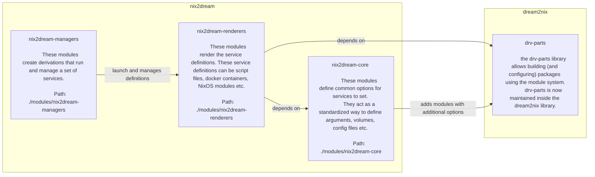

# Nix2Dream

Use the NixOs module system turn derivations into services that can be launched/managed by any supported service-manager:

- [x] procfile
- [ ] NixOS Service
- [ ] NixOS VM 
- [ ] Docker
  - [ ] Kubernetes
  - [ ] Docker Compose

Few features are implemented currently, but I have confidence in the architecture and that it will scale. See the [Roadmap](https://github.com/DrRuhe/nix2dream/issues/1) for the current status.

# Architecture


# Usage: 

## As a flake-parts module
To use nix2dream in a flake-parts flake, you can import the flakeModule by adding `inputs.nix2dream.flakeModule` to your imports:
```nix
imports = [
    inputs.nix2dream.flakeModule
];
```
Then, services and deployments can be defined under `perSystems.deployments`. See the [examples](./examples).


## Standalone
The modules do not require flake-parts and can be integrated into other module-systems by using `inputs.nix2dream.standaloneSubmodule` as a submodule. 
You can look at `./nix/flake-parts/nix2dream.nix` for a reference on how this is done for integration with the flake-parts module ecosystem.
It's important that you pass nixpkgs as specialArgs in order for nix2dream internals and dream2nix modules to work correctly. See [`./nix/nix2dream/service/dependencies.nix`](./nix/nix2dream/service/dependencies.nix)

# Contact
Feel free to open Issues [here](https://github.com/DrRuhe/nix2dream/issues/new/choose).

# Extensibility
A big goal of this library is to be extensible. Using the NixOS module system nicely achieves that, as it is possible to utilize your own custom renderers and managers by simply including their modules.

## Adding a renderer
To add a renderer, simply import the service-side renderer module in the service and the deployment-wide renderer in the deployment module.

## Adding a manager
To add a manager, import the manager module into the deployment. 


